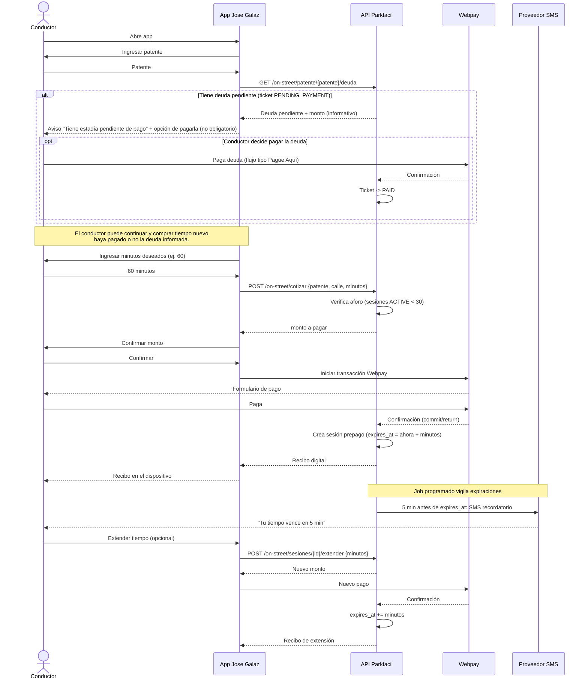
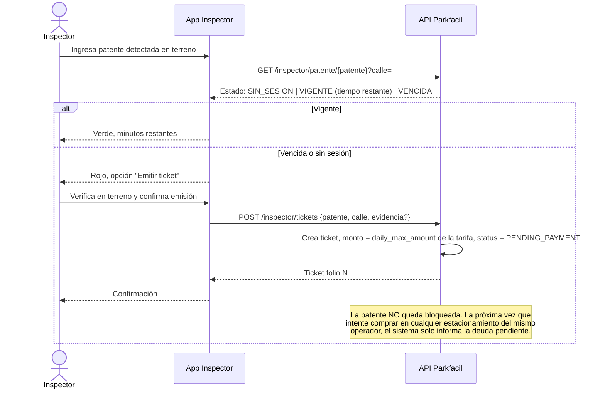
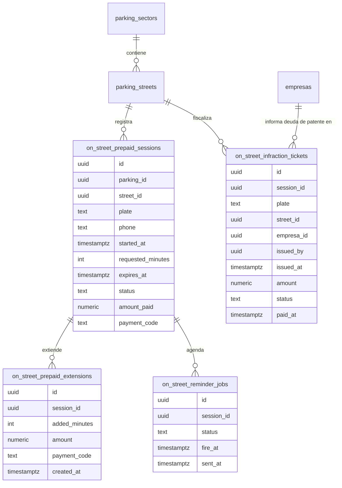

# Proyecto Jose Galaz On Street — Prepago vía pública

## 1. Resumen ejecutivo

Calle Jose Galaz, 30 plazas de estacionamiento en vía pública, **aforo total** (no numeradas). Sistema de **prepago por duración fija** con app para conductores (Android/iOS/PC) y app de fiscalización para inspectores. Flujo conductor: patente → verificación de deuda pendiente → minutos deseados → cotización → Webpay → recibo → aviso SMS 5 min antes del vencimiento → extensión opcional. Flujo inspector: patente → estado/tiempo restante → si venció, emite ticket por el valor máximo diario fijo de la tarifa, que queda **pendiente de pago** y bloquea nuevas compras del mismo conductor hasta saldarlo.

Existe convenio/autorización municipal vigente, lo que despeja el mayor riesgo legal del proyecto. La deuda pendiente **no bloquea** la compra de tiempo nuevo: solo se informa al conductor al momento de ingresar su patente, quedando el cobro como un recordatorio persistente hasta que la salde. Este documento define el diseño y flujo completo, y deja registradas las decisiones de negocio ya tomadas.

## 2. Decisiones de negocio confirmadas

| Pregunta | Decisión | Implicancia de diseño |
|---|---|---|
| ¿Cupos numerados o aforo total? | **Aforo total** (30 plazas sin numerar) | No se modela `slot_number`; la disponibilidad es `COUNT(sesiones ACTIVE) < 30` sobre la calle. Más simple que un modelo de reserva por plaza. |
| ¿Proveedor SMS? | No hay proveedor contratado — Parkfacil debe evaluar y proponer | Ver §8, shortlist de candidatos investigados. |
| ¿Convenio municipal para tarifar y multar? | **Sí, vigente** | Despejado. El diseño puede asumir que el ticket de infracción es exigible. |
| ¿PWA o app nativa en tiendas? | A definir — inclinación inicial por PWA | Ver §9, recomendación con evidencia y camino de migración a tienda sin rehacer backend. |
| ¿Cómo se cobra el ticket sin retención vehicular? | **Deuda pendiente por patente, informativa, no bloqueante**: el ticket queda `PENDING_PAYMENT`; la próxima vez que esa patente intente iniciar una sesión prepaga en Jose Galaz **o en cualquier otro estacionamiento del mismo operador**, el sistema **informa** la deuda y ofrece pagarla (flujo tipo "Pague Aquí"), pero **no impide** continuar y comprar tiempo nuevo aunque no la pague. | Es un cambio **transversal**, no exclusivo de Jose Galaz: se necesita una consulta de deuda por patente a nivel de operador/empresa que se muestre antes de cualquier venta prepaga, sin condicionar el flujo de compra. Ver §6. |
| ¿Cuántos inspectores? | 1, sin proyección inmediata de más calles | No cambia el diseño; el modelo ya soporta múltiples inspectores y calles sin ajustes adicionales. |
| ¿Tope diario fijo o variable? | **Fijo**, definido en la tarifa | Se agrega `daily_max_amount` como campo fijo de la tarifa asignada al sector/calle, no una fórmula. |

## 3. Diferencia clave con el modelo actual

Parkfacil ya tiene "Pague Aquí": se registra una `parking_stay` con `entry_at`, el conductor paga **al salir** según minutos transcurridos (`parkingStayQuoteService.js`, `webpayStayAccreditation.js`). Jose Galaz es lo opuesto: se paga **por adelantado**, por una duración que el conductor elige, sin barrera ni sensor de entrada/salida. El "check-in" es el propio pago. Esto implica:

- No hay `entry_at` físico que gatille la sesión; la gatilla el pago aprobado.
- La sesión tiene un `expires_at` conocido de antemano, no un cierre calculado al final.
- Se necesita un job programado (no existe hoy en Parkfacil) que vigile expiraciones y dispare el SMS T-5 min.
- La extensión es un nuevo pago que **empuja** `expires_at`, no un recálculo de estadía abierta.
- A diferencia de "Pague Aquí", aquí el impago no se detecta al salir: lo detecta el **inspector en terreno**, y el cobro queda como deuda informativa que se recuerda en la **próxima compra** de esa patente (ver §6), sin impedirla. El diseño de "Pague Aquí" no contempla hoy este aviso de deuda — es una capacidad nueva y compartida.

## 4. Flujo del conductor



## 5. Flujo del inspector



## 6. Deuda pendiente por patente (capacidad transversal, informativa y no bloqueante)

Esta es la pieza de diseño más importante que surge de la decisión de negocio: el cobro del ticket no se ejecuta en el momento, sino que se **informa al conductor la próxima vez que intente estacionar**, en Jose Galaz o en cualquier otro estacionamiento administrado por el mismo operador (misma `empresa`/mandante). **No es un bloqueo**: el conductor puede ignorar el aviso y comprar tiempo nuevo de todas formas. El mecanismo de cobro es la insistencia del aviso en cada intento de compra, no una restricción técnica.

Esto significa que la consulta de deuda no puede vivir aislada dentro de "Jose Galaz On Street": debe ser una consulta que **cualquier punto de venta prepago del operador** haga antes de vender, sin condicionar el resultado (hoy solo existiría para Jose Galaz, pero el gancho debe quedar genérico para no reconstruirlo si mañana se replica el modelo en otra calle). Se propone:

- Endpoint interno `getPendingDebt(plate, empresaId)` consultado por el flujo de cotización/pago, de solo lectura — nunca impide la operación siguiente.
- El ticket `PENDING_PAYMENT` es la fuente de verdad de la deuda; al pagarse pasa a `PAID` y deja de mostrarse el aviso.
- El pago de la deuda (si el conductor decide hacerlo) reutiliza el patrón Webpay ya existente (crear transacción → confirmar → marcar pagado), igual que "Pague Aquí".
- Mensaje al usuario: *"Tiene estadía pendiente de pago"*, con acción **opcional** para pagarla; el flujo de compra de tiempo nuevo continúa igual si el conductor no la paga.

## 7. Modelo de datos propuesto

No se reutiliza `parking_stays` tal cual porque su ciclo de vida es "entrada→salida con cobro al cierre". Se proponen tablas nuevas, en el mismo espíritu que `billing_document_jobs` (Etapa 8B) para el patrón outbox de notificaciones.



- Sesión `status`: `ACTIVE`, `EXPIRED`, `CLOSED`.
- Ticket `status`: `PENDING_PAYMENT` (se informa en cada intento de compra, no bloquea), `PAID` (deja de informarse), `VOID` (anulado, ej. reclamo aceptado).
- No hay `slot_number`: la disponibilidad de las 30 plazas se calcula como aforo (`COUNT(*) FILTER (status = 'ACTIVE')` por calle).

## 8. Proveedor SMS — no hay contrato hoy, candidatos evaluados

Parkfacil no tiene canal SMS (`NOTIFICATION_CHANNELS` hoy es `["email", "whatsapp", "internal"]`, y WhatsApp está sin configurar). Se requiere contratar uno. Búsqueda preliminar de opciones para Chile — **cotizar y confirmar con el operador antes de comprometer costos**, los precios varían por volumen y no están públicos con precisión:

| Proveedor | Tipo | Notas |
|---|---|---|
| **ConnectUs** ([connectus.cl](https://www.connectus.cl/)) | Local (Chile) | Mencionado en el mercado desde ~16 CLP/SMS; plataforma + API. Candidato principal por ser local (mejor entregabilidad y soporte en español). |
| **Unimatrix** ([unimtx.com/sms/cl](https://www.unimtx.com/sms/cl)) | Internacional con cobertura Chile | Ofrece SMS OTP y API de mensajería transaccional, relevante para el caso de uso (recordatorio, no marketing masivo). |
| **Infobip** | Internacional (enterprise) | Buena opción si Parkfacil ya usa o planea multicanal (SMS + WhatsApp Business API oficial) bajo un solo proveedor; más caro pero API robusta y SLA. |
| **Twilio** | Internacional | Referencia de mercado, API muy documentada; costos y entregabilidad a números chilenos deben verificarse (no es local). |

Recomendación: levantar cotización formal con **ConnectUs** y **Unimatrix** en paralelo (ambos con presencia/soporte en Chile), y evaluar **Infobip** si se quiere dejar la puerta abierta a WhatsApp Business API oficial más adelante con un solo proveedor. Criterio de selección: costo por SMS transaccional, tasa de entrega a plan de numeración chileno, latencia (crítico porque el aviso es a 5 minutos del vencimiento) y facilidad de integración (API REST + webhook de estado de entrega).

Sources: [ConnectUs](https://www.connectus.cl/) · [Unimatrix SMS Chile](https://www.unimtx.com/sms/cl) · [Afilnet SMS Chile](https://www.afilnet.com/es/sms-masivo/chile/)

## 9. Multiplataforma (Android / iOS / PC) — PWA vs. nativa

La inclinación inicial era PWA; investigando el estado del arte 2025-2026, la recomendación se matiza:

- Para apps de **uso operacional recurrente y con dinero de por medio** (como parquímetros), la evidencia de mercado indica que los usuarios depositan más confianza en apps distribuidas por las tiendas oficiales, y las apps nativas aprovechan mejor cámara/GPS del dispositivo.
- Al mismo tiempo, el recordatorio de Jose Galaz va por **SMS, no por push nativo**, así que la limitación clásica de PWA en iOS (push notifications) no es un bloqueante aquí.

**Recomendación en dos tiempos:**

1. **Fase 1 (validación / piloto en Jose Galaz):** PWA responsive sobre el stack Next.js/Supabase existente, instalable en Android/iOS/escritorio. Permite lanzar rápido con un solo código base y validar el flujo real de cobro y fiscalización con bajo costo.
2. **Fase 2 (si el piloto valida y se busca escalar a más calles/operadores):** empaquetar la misma PWA con **Capacitor** (o similar) para publicarla en App Store y Play Store sin rehacer el backend ni la lógica de negocio, ganando presencia en tienda y confianza del usuario, y accediendo a APIs nativas (cámara para evidencia del inspector, geolocalización) si se necesitan.

La app del inspector, al ser una herramienta interna y no pública, puede quedarse en PWA sin necesidad de tienda.

Sources: [PWA vs App nativa 2025 — Color Vivo](https://colorvivo.com/progressive-web-apps-pwa-en-2025-sustituyen-a-las-apps-nativas/) · [PWA vs Native Apps 2026 — Carmatec](https://www.carmatec.com/blog/pwa-vs-native-apps-what-should-you-pick/)

## 10. Qué se reutiliza de Parkfacil tal cual

| Pieza | Reutilización |
|---|---|
| `parking_sectors` / `parking_streets` (ON_STREET) | Ya modela calles y sectores; Jose Galaz se da de alta como calle con capacidad 30 (aforo total). |
| Motor tarifario (`MOTOR-TARIFARIO-LEGAL.md`) | Cotización por minutos, igual que "Pague Aquí"; se le agrega `daily_max_amount` fijo. |
| Webpay adapter (`webpayStayAccreditation.js`, rutas `pague-aqui/webpay`) | Mismo patrón de creación/confirmación de transacción; se adapta a cotización directa y también al pago de deuda pendiente (§6). |
| `MockBillingProviderAdapter` + `documentJobCore` (Etapa 8B) | Emisión del recibo al dispositivo con el mismo patrón outbox (`PENDING/PROCESSING/COMPLETED/FAILED`) usado para boletas/facturas. |
| Módulo de notificaciones (`src/lib/notifications`) | Se agrega tipo `prepaid_session_expiring` y canal SMS nuevo (§8). |
| Auth/permisos (`permissions.mjs`) | Se agrega rol `INSPECTOR` con permiso acotado a consulta de patente + emisión de tickets. |
| Multi-tenant por `empresa` | Base para que el aviso de deuda opere "en cualquier estacionamiento del mismo operador" (§6). |

## 11. Brechas restantes a resolver

1. **Sin proveedor SMS contratado.** Ver §8 — acción: cotizar y firmar con uno de los candidatos.
2. **No hay scheduler/cron.** El aviso T-5 min y la expiración automática necesitan un job periódico (Supabase Edge Function con cron, o worker externo) que no existe hoy en el proyecto. Se modela como outbox (`on_street_reminder_jobs`), igual que `billing_document_jobs`.
3. **`daily_max_amount` no existe en el motor de tarifas.** Se agrega como campo fijo de la tarifa asignada al sector/calle.
4. **Fiscalización 100% manual con 1 inspector.** Sin sensores ni cámaras LPR, el throughput real de fiscalización de las 30 plazas depende de la frecuencia de ronda del inspector; a mayor intervalo entre pasadas, mayor probabilidad de que una infracción no se detecte el mismo día.
5. **Rol `INSPECTOR` nuevo** en el sistema de permisos y en la UI de administración de usuarios.
6. **Definir alcance exacto de "mismo operador"** para el aviso de deuda: ¿es por `empresa_id` (mandante) o debería incluir estacionamientos de terceros que usan Parkfacil? Se asume `empresa_id` por defecto.
7. **Al no ser bloqueante, la efectividad del cobro depende de la insistencia del aviso y de la voluntad del conductor.** Vale la pena definir con el negocio si en el futuro se quiere escalar (ej. recargo por mora, límite de tickets impagos antes de bloquear) — hoy explícitamente no se bloquea, se deja registrado por si cambia el criterio.

## 12. Endpoints propuestos

```
GET  /api/on-street/patente/[patente]/deuda        -> deuda pendiente (si existe) por operador; solo informativa, no condiciona los endpoints siguientes
POST /api/on-street/cotizar            {patente, streetId, minutos} -> monto
POST /api/on-street/pagar              inicia transacción Webpay (sesión nueva o pago de deuda)
POST /api/on-street/webpay/confirm     confirma pago -> crea sesión + recibo + agenda recordatorio, o salda deuda
POST /api/on-street/sesiones/[id]/extender   {minutos} -> nuevo pago, empuja expires_at
GET  /api/inspector/patente/[patente]?streetId= -> estado y tiempo restante
POST /api/inspector/tickets            {patente, streetId, evidencia?} -> ticket PENDING_PAYMENT
```

Todos siguen el patrón ya usado en `pague-aqui` (auth por header de servicio para procesos internos, `authorizeParkingRequest`/permisos para operaciones de usuario).

## 13. Fases sugeridas de incorporación

| Etapa | Contenido |
|---|---|
| A | Modelo de datos + cotización prepago on-street (reuso motor tarifario, `daily_max_amount`) |
| B | Integración Webpay prepago + recibo digital (reuso adapter/outbox de Etapa 8B) |
| C | App conductor (PWA): patente → deuda → duración → pago → recibo |
| D | Proveedor SMS contratado + scheduler de recordatorio T-5 min y expiración automática |
| E | App/vista inspector: consulta de patente + emisión de tickets |
| F | Extensión de tiempo con nuevo pago |
| G | Aviso transversal de deuda pendiente, no bloqueante (§6), aplicable a futuras calles/operadores |
| H | Empaquetado con Capacitor para tiendas (si el piloto lo justifica) |

## 14. Pendientes menores para cerrar antes de estimar esfuerzo

- Frecuencia mínima de ronda del inspector aceptable operacionalmente (define expectativa de detección de infracciones).
- Confirmar con el operador si el aviso de deuda debe incluir estacionamientos Off Street del mismo operador, o solo On Street.
- Cotización formal de ConnectUs/Unimatrix/Infobip para cerrar el proveedor SMS.
